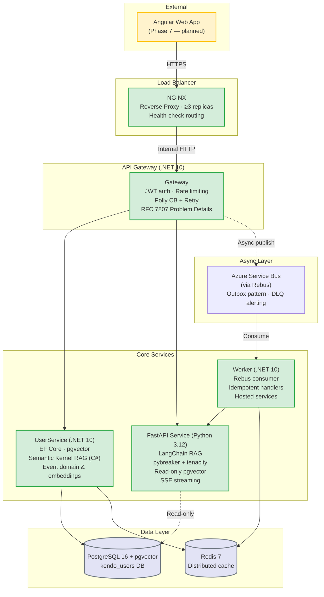

# Kendo — Orchestration Loop & Target Platform

This repository contains both the **Agentic Orchestration Loop** (the virtual software factory) and the **Target Platform** (a highly resilient, multi-instance microservice ecosystem).

---

## 🏭 The Orchestration Loop

The orchestration pipeline processes daily milestones into production-ready code through a strict, 6-phase gated loop.

1. **Phase 0:** State Initialization (`.ai/current_state.md`)
2. **Phase 1:** Architecture & Contract Design (Platform Architect)
3. **Phase 2:** Implementation & Validation (Developer + QA)
4. **Phase 4:** Delivery & CI/CD (DevOps / SRE)
5. **Phase 4b:** Review, Merge & State Update (Reviewer)
6. **Phase 5:** State Update & Changelog

> See `docs/platform_roadmap.md` for the full resilience roadmap (Phases 01–05).
> See `.ai/orchestration.md` for the complete orchestration loop specification.

---

## 🌐 Target Platform Architecture



### Component Status

| Component | Status | Path | Phase | Description |
|---|---|---|---|---|
| `Gateway` (.NET 10) | ✅ Built | `src/Gateway/` | 01 | JWT auth, rate limiting, Polly CB + retry, RFC 7807 |
| `UserService` (.NET 10) | ✅ Built | `src/UserService/` | 01 | EF Core, pgvector, Semantic Kernel RAG, event domain |
| `Worker` (.NET 10) | ✅ Built | `src/Worker/` | 01–02 | Rebus consumer, idempotent handlers, notification dispatch |
| `FastAPIService` (Python) | ✅ Built | `src/FastAPIService/` | 05 | LangChain RAG, pybreaker + tenacity, read-only pgvector, SSE |
| NGINX | ✅ Built | `docker-compose.yml` | 03 | Load balancing, ≥ 3 replicas, health-check routing |
| Redis | ✅ Built | `docker-compose.yml` | 03 | Distributed cache, replica identity |
| Angular Web App | 🟡 Planned | — | 07 | GUI / admin dashboard |

---

## 📋 API Endpoints

### Gateway (`http://localhost:5000`)

| Method | Path | Auth | Description | Milestone |
|--------|------|------|-------------|-----------|
| `GET` | `/health/live` | None | Liveness probe | M1.1 |
| `GET` | `/health/ready` | None | Readiness probe | M1.1 |
| `POST` | `/api/auth/token` | AdminToken | Issue user JWT | CF-2 |
| `POST` | `/api/users` | JWT | Create user | M2.2 |
| `GET` | `/api/users/{id}/status` | JWT | Poll async status | M2.2 |
| `GET` | `/api/users/search?q=&top_k=` | JWT | Hybrid semantic search (proxied) | M5.9 |
| `GET` | `/api/events` | JWT | List user events | M0.6 |
| `GET` | `/api/events/{id}` | JWT | Get event by ID | M0.6 |
| `POST` | `/api/events` | JWT | Create event | M0.6 |
| `PATCH` | `/api/events/{id}` | JWT | Update event | M0.6 |
| `DELETE` | `/api/events/{id}` | JWT | Delete event | M0.6 |
| `POST` | `/api/events/ingest` | JWT | Ingest free-form text → structured Event | M5.7 |
| `GET` | `/api/events/ingest/{id}/stream` | JWT | SSE stream of ingestion | M5.7 |
| `POST` | `/api/events/{id}/validate` | JWT | Conflict & schedule reasoning | M5.8 |
| `GET` | `/api/rag/query` | JWT | Sync RAG query (proxied) | M5.4 |
| `GET` | `/api/rag/stream` | JWT | SSE RAG stream (proxied) | M5.4 |
| `POST` | `/api/assistant/ask` | JWT | Document Q&A (proxied) | M5.12 |

### UserService (`http://localhost:5001`)

| Method | Path | Auth | Description | Milestone |
|--------|------|------|-------------|-----------|
| `GET` | `/health/live` | None | Liveness probe | M1.1 |
| `GET` | `/health/ready` | None | Readiness probe | M1.1 |
| `POST` | `/internal/embeddings` | `admin:writes` + service JWT | Upsert single embedding | M5.11 |
| `POST` | `/internal/embeddings/batch` | `admin:writes` + service JWT | Batch upsert embeddings | M5.11 |
| `POST` | `/internal/events/{id}/reindex` | `admin:writes` + service JWT | Re-embed single event | M5.11 |

### FastAPI (`http://localhost:8000`, internal only)

| Method | Path | Auth | Description | Milestone |
|--------|------|------|-------------|-----------|
| `GET` | `/health/live` | None | Liveness probe | M5.1 |
| `GET` | `/health/ready` | None | Readiness probe | M5.1 |
| `POST` | `/v1/rag/query` | JWT | Sync RAG query | M5.2 |
| `POST` | `/v1/rag/stream` | JWT | SSE RAG stream | M5.2 |
| `POST` | `/v1/rag/ingest` | JWT | Event ingestion | M5.7 |
| `POST` | `/v1/rag/validate` | JWT | Event conflict validation | M5.8 |
| `GET` | `/v1/users/search` | JWT | Hybrid user search | M5.9 |
| `POST` | `/v1/intent/classify` | JWT | Intent classification | M5.10 |
| `POST` | `/v1/assistant/ask` | JWT | Document Q&A | M5.12 |
| `POST` | `/v1/notifications/summarize` | JWT | SSE notification summarization | M5.13 |

### Worker (`http://localhost:5002`, internal only)

| Method | Path | Auth | Description | Milestone |
|--------|------|------|-------------|-----------|
| `GET` | `/health/live` | None | Liveness probe | M1.1 |
| `GET` | `/health/ready` | None | Readiness probe | M1.1 |

---

## 🚀 Local Setup

### Prerequisites

- [Docker Desktop](https://www.docker.com/products/docker-desktop/) (with Compose v2)
- .NET 10 SDK (for local development / testing)
- Python 3.12 + `uv` (for FastAPI local development)

### Quick Start

```bash
# 1. Clone and enter the repo
git clone https://github.com/kekcoke/kendo.git
cd kendo

# 2. Copy environment template
cp .env.example .env

# 3. Start all services
docker compose up -d

# 4. Verify everything is healthy
./scripts/verify_health.sh

# 5. Run the full test suite
dotnet test src/Kendo.slnx --filter "Category!=Chaos&Category!=Messaging"
```

### What Gets Started

| Service | Port (host) | Replicas | Health check |
|---------|-------------|----------|--------------|
| NGINX | `5000` | 1 | `GET /nginx-health` |
| Gateway | internal | 3 | `GET /health/live` + `/health/ready` |
| UserService | internal | 3 | `GET /health/live` + `/health/ready` |
| Worker | internal | 3 | `GET /health/live` + `/health/ready` |
| FastAPI | internal | 2 | `GET /health/live` + `/health/ready` |
| PostgreSQL | `5432` | 1 | `pg_isready` |
| Redis | `6379` | 1 | `redis-cli ping` |

### Local Development

```bash
# Build .NET solution
dotnet build src/Kendo.slnx

# Run .NET tests (unit + data + resilience)
dotnet test tests/Kendo.Tests --filter "Category!=Chaos&Category!=Messaging"

# Run FastAPI tests
cd src/FastAPIService
.venv/bin/python -m pytest tests/fastapi/ -v

# Run W8 eval gate (DeepEval + Ragas regression suite)
.venv/bin/python -m pytest tests/fastapi/eval/ -v
```

---

## 🔧 Consolidated Command Reference

### Docker Compose

```bash
# Start all services
docker compose up -d

# Start with custom replica count
docker compose up -d --scale gateway=3 --scale userservice=3 --scale worker=3

# View logs
docker compose logs -f

# Stop and remove
docker compose down

# Rebuild images
docker compose build

# Check health status
docker compose ps --format json | grep '"Health"'
```

### Verification

```bash
# Health check through NGINX
curl -fsS http://localhost:5000/health/live
curl -fsS http://localhost:5000/health/ready
curl -fsS http://localhost:5000/nginx-health

# Check replica identity headers
for i in $(seq 1 10); do
  curl -sI http://localhost:5000/health/live | grep -i "X-Kendo-Replica"
done

# Test RAG query
curl -X POST http://localhost:5000/api/events/ingest \
  -H "Content-Type: application/json" \
  -H "Authorization: Bearer $(cat /tmp/test-jwt)" \
  -d '{"text": "Team standup tomorrow at 10am in room 3B"}'

# Test assistant Q&A
curl -X POST http://localhost:5000/api/assistant/ask \
  -H "Content-Type: application/json" \
  -H "Authorization: Bearer $(cat /tmp/test-jwt)" \
  -d '{"query": "How do I deploy the FastAPI service?"}'

# Rebuild assistant index
./scripts/assistant-reindex.sh
```

### CI Pipeline

```bash
# The CI pipeline has 4 jobs:
# 1. build-and-test — .NET unit + data + resilience + messaging tests
# 2. docker-compose — Single + multi-replica Docker health verification
# 3. chaos-test — Docker chaos scenarios (DB down, crash, partition)
# 4. eval-gate — DeepEval + Ragas LLM regression suite

# Run CI locally (requires Docker + dotnet SDK)
dotnet build src/Kendo.slnx
dotnet test tests/Kendo.Tests --filter "Category!=Chaos&Category!=Messaging"
docker compose up -d --scale gateway=3 --scale userservice=3 --scale worker=3
```

### Chaos Tests

```bash
# Run all chaos scenarios
chmod +x scripts/chaos/*.sh
scripts/chaos/run_all.sh

# Run FastAPI chaos tests
cd src/FastAPIService
.venv/bin/python -m pytest tests/chaos/ -v --chaos
```

### State Validation

```bash
# Validate day artifacts exist
./scripts/validate_state.sh 35

# Audit all documentation gaps
./scripts/validate_state.sh --audit
```

---

## 📂 Project Structure

```
.
├── .ai/                          # Orchestration state & master rules
│   ├── current_state.md          # Live checkpoint — updated every phase
│   └── orchestration.md          # Master orchestration loop specification
├── .github/workflows/
│   └── ci.yml                    # CI pipeline: build → test → docker → chaos → eval
├── docs/
│   ├── architecture/             # Per-day specs + review reports (35+ days)
│   │   ├── fastapi_rag_service_spec.md  # FastAPI data contracts & workload catalog
│   │   └── day_*_spec.md         # Daily milestone specifications
│   └── platform_roadmap.md       # Long-term resilience plan (Phases 01–05)
├── ops/
│   ├── runbooks/                 # 35+ operational runbooks
│   │   ├── db-failover.md        # PostgreSQL failover playbook
│   │   ├── service-crash-recovery.md
│   │   ├── dlq-drain.md          # Dead Letter Queue drain procedure
│   │   ├── horizontal-scaling.md
│   │   └── fastapi_service.md    # FastAPI incident response
│   └── nginx/                    # NGINX configuration
├── scripts/
│   ├── chaos/                    # Chaos test scenarios (bash)
│   ├── validate_state.sh         # Phase artifact validator
│   └── assistant-reindex.sh      # W6 corpus index builder
├── src/
│   ├── Gateway/                  # .NET 10 API Gateway
│   ├── UserService/              # .NET 10 user domain + pgvector
│   ├── Worker/                   # .NET 10 background worker
│   ├── Shared/                   # Shared libraries (Polly, OTel, auth, messaging)
│   └── FastAPIService/           # Python 3.12 FastAPI + LangChain RAG
├── templates/                    # Agent prompts & skill definitions
└── changelog/                    # Per-day changelogs
```

---

## 📊 Phase Summary

| Phase | Name | Status | Key Deliverables |
|-------|------|--------|-----------------|
| 01 | Core APIs & Synchronous Resilience | ✅ Complete | Gateway, UserService, Worker, Polly, OTel, RFC 7807 |
| 02 | Asynchronous Decoupling | ✅ Complete | Rebus + ASB, idempotency, DLQ, outbox, traceparent |
| 03 | High Availability & Chaos | ✅ Complete | NGINX LB, Redis, chaos suite, rate limiting, runbooks |
| 04 | Pre-FastAPI Reconciliation | ✅ Complete | JWT auth, AI event contracts, queue topology, event domain |
| 05 | AI/Vector Service (FastAPI) | ✅ Complete | 14 milestones (M5.1–M5.14), 8 workloads (W1–W8) |
| 06 | Production Readiness | 🔄 In progress | README update, CI hardening, docs gap closure |
| 07 | Angular GUI | 🟡 Planned | Web dashboard for platform management |
| 08 | Hetzner Deployment | 🟡 Planned | Terraform + Docker Compose on Hetzner Cloud |

---

## 🧪 Test Coverage

| Suite | Framework | Count | Run Command |
|-------|-----------|-------|-------------|
| .NET Unit | xUnit | ~130 | `dotnet test --filter "Category=Unit"` |
| .NET Data | xUnit | ~25 | `dotnet test --filter "Category=Data"` |
| .NET Resilience | xUnit | ~20 | `dotnet test --filter "Category=Resilience"` |
| .NET Messaging | xUnit | ~15 | `dotnet test --filter "Category=Messaging"` |
| FastAPI Unit | pytest | 136 | `pytest tests/fastapi/` |
| FastAPI Chaos | pytest | 4 | `pytest tests/chaos/ --chaos` |
| W8 Eval Gate | DeepEval + Ragas | ~20 | `pytest tests/fastapi/eval/` |
| Chaos Scenarios | bash | 3 | `scripts/chaos/run_all.sh` |

---

## 🔗 Key Links

- [Platform Roadmap](docs/platform_roadmap.md) — Phase-by-phase delivery plan
- [Orchestration Rules](.ai/orchestration.md) — How the factory processes milestones
- [FastAPI Spec](docs/architecture/fastapi_rag_service_spec.md) — Workload catalog & data contracts
- [Current State](.ai/current_state.md) — Live checkpoint of all deliverables
